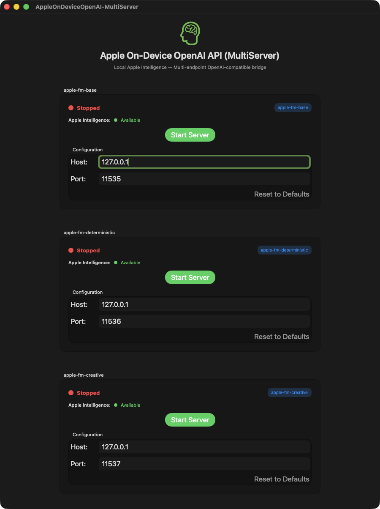
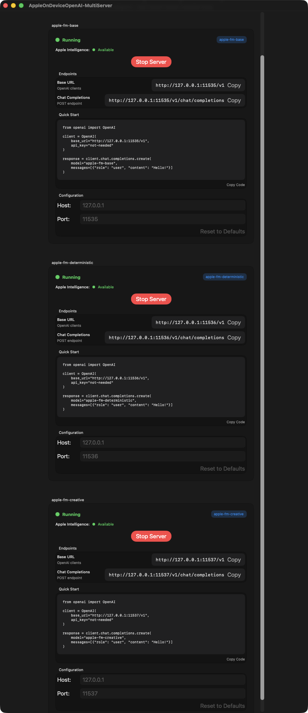
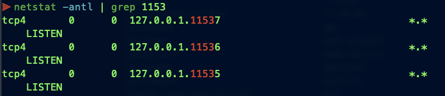
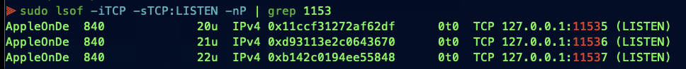
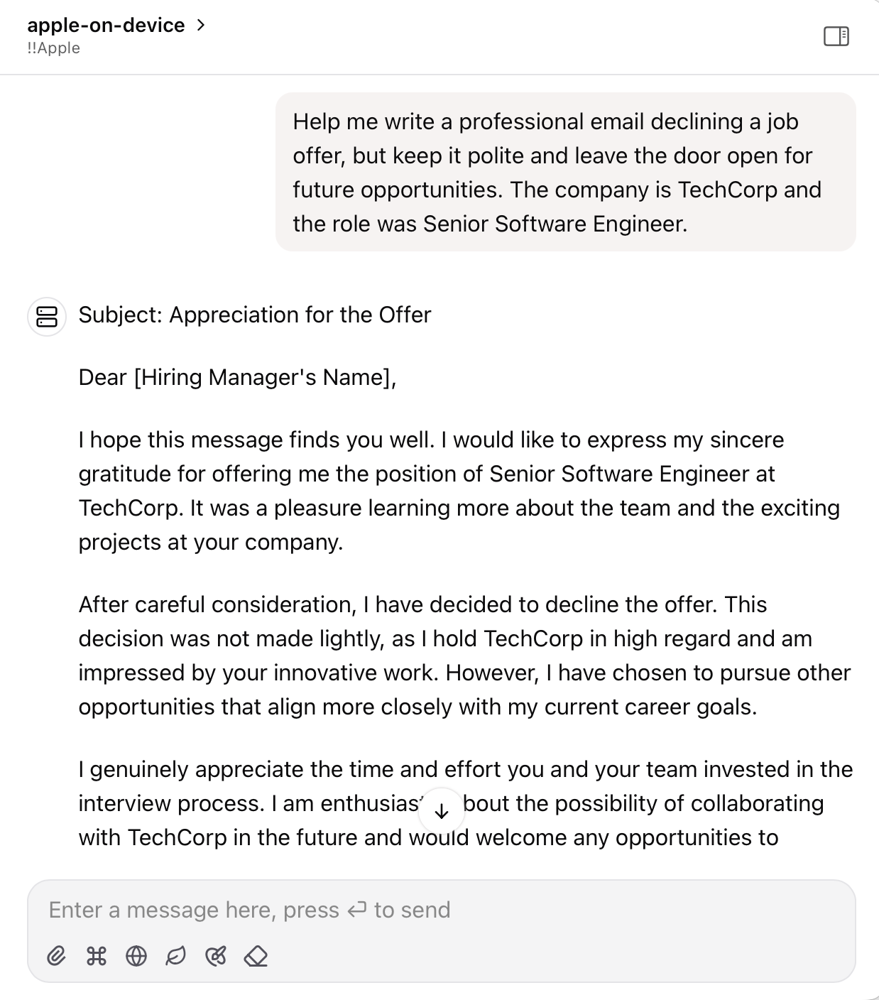

# Apple On-Device OpenAI API

A SwiftUI application that creates an OpenAI-compatible API server using Apple's on-device Foundation Models. This allows you to use Apple Intelligence models locally through familiar OpenAI API endpoints.

## Screenshot - Updated UI Enhanced for MultiServer:




## Screenshot - All Three MultiServer Services Started:




## Screenshot - Using Terminal and "netstat" to Verify Services:




## Screenshot - Using Terminal and "lsof" to Verify Services:




## Screenshot - Use it in any OpenAI compatible app:




## Features

- **OpenAI Compatible API**: Drop-in replacement for OpenAI API with chat completions endpoint
- **Streaming Support**: Real-time streaming responses compatible with OpenAI's streaming format
- **On-Device Processing**: Uses Apple's Foundation Models for completely local AI processing
- **Model Availability Check**: Automatically checks Apple Intelligence availability on startup
- **🚧 Tool Using (WIP)**: Function calling capabilities for extended AI functionality

## Requirements

- **macOS**: 26 beta 2
- **Apple Intelligence**: Must be enabled in Settings > Apple Intelligence & Siri
- **Xcode**: 26 beta 2 (for building)

## Installation

### Option 1: Download Pre-built App (Recommended)

1. Go to the [Releases](https://github.com/gety-ai/apple-on-device-openai/releases) page
2. Download the latest `.zip` file
3. Extract and launch the app

### Option 2: Build from Source

1. Clone the repository:
```bash
git clone https://github.com/gety-ai/apple-on-device-openai.git
cd apple-on-device-openai
```

2. Open the project in Xcode:
```bash
open AppleOnDeviceOpenAI.xcodeproj
```

3. Build and run the project in Xcode

## Why a GUI App Instead of Command Line?

This project is implemented as a GUI application rather than a command-line tool due to **Apple's rate limiting policies** for Foundation Models:

> "An app that has UI and runs in the foreground doesn't have a rate limit when using the models; a macOS command line tool, which doesn't have UI, does."
> 
> — Apple DTS Engineer ([Source](https://developer.apple.com/forums/thread/787737))

**⚠️ Important Note**: You may still encounter rate limits due to current limitations in Apple FoundationModels. If you experience rate limiting, please restart the server.

**⚠️ 重要提醒**: 由于苹果 FoundationModels 当前的限制，您仍然可能遇到速率限制。如果遇到这种情况，请重启服务器。


## Usage

### Starting the Server

1. Launch the app
2. Configure server settings (default: `127.0.0.1:11535`)
3. Click "Start Server"
4. Server will be available at the configured address

### Available Endpoints

Once the server is running, you can access these OpenAI-compatible endpoints:

- `GET /health` - Health check
- `GET /status` - Model availability and status
- `GET /v1/models` - List available models
- `POST /v1/chat/completions` - Chat completions (streaming and non-streaming)

### Example Usage

#### Using curl:
```bash
curl -X POST http://127.0.0.1:11535/v1/chat/completions \
  -H "Content-Type: application/json" \
  -d '{
    "model": "apple-on-device",
    "messages": [
      {"role": "user", "content": "Hello, how are you?"}
    ],
    "temperature": 0.7,
    "stream": false
  }'
```

#### Using OpenAI Python client:
```python
from openai import OpenAI

# Point to your local server
client = OpenAI(
    base_url="http://127.0.0.1:11535/v1",
    api_key="not-needed"  # API key not required for local server
)

response = client.chat.completions.create(
    model="apple-on-device",
    messages=[
        {"role": "user", "content": "Hello, how are you?"}
    ],
    temperature=0.7,
    stream=True  # Enable streaming
)

for chunk in response:
    if chunk.choices[0].delta.content:
        print(chunk.choices[0].delta.content, end="")
```

## Testing

You can use the included test script to verify the server is working correctly and see example usage patterns:

```bash
python3 test_server.py
```

The test script will:
- ✅ Check server health and connectivity
- ✅ Verify model availability and status
- ✅ Test OpenAI SDK compatibility
- ✅ Run multi-turn conversations
- ✅ Test multilingual support (Chinese)
- ✅ Demonstrate streaming functionality

Make sure the server is running before executing the test script. The script provides comprehensive examples of how to interact with the API using both direct HTTP requests and the OpenAI Python SDK.

## API Compatibility

This server implements the OpenAI Chat Completions API with the following supported parameters:

- `model` - Model identifier (use "apple-on-device")
- `messages` - Array of conversation messages
- `temperature` - Sampling temperature (0.0 to 2.0)
- `max_tokens` - Maximum tokens in response
- `stream` - Enable streaming responses

## Development Notes

🤖 This project was mainly "vibe coded" using Cursor + Claude Sonnet 4 & ChatGPT o3.


## License

This project is licensed under the MIT License - see the LICENSE file for details.

## References

- [Apple Foundation Models Documentation](https://developer.apple.com/documentation/foundationmodels)
- [OpenAI API Documentation](https://platform.openai.com/docs/api-reference) 
