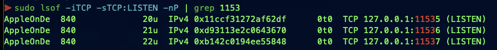

## Screenshot - Updated UI Enhanced for MultiServer:

  
## Screenshot - All Three MultiServer Services Started:

  
## Screenshot - Using Terminal and "netstat" to Verify Services:

  
## Screenshot - Using Terminal and "lsof" to Verify Services:

  
## Screenshot - Using Open-Webui as the chat frontend, here for "apple-fm-deterministic":

  
## Screenshot - Using Open-Webui as the chat frontend, here for "apple-fm-creative":

  
